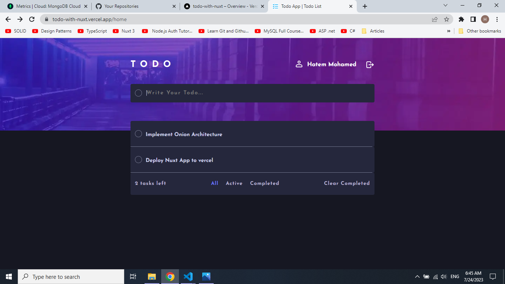
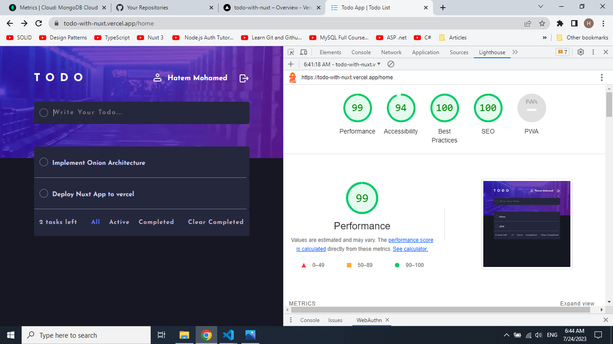

# Todo With Nuxt

<nobr> <nobr/>
<nobr> <nobr/>
<nobr> <nobr/>
<nobr> <nobr/>

## Table of contents

- [Overview](#overview)
  - [The Challenge](#the-challenge)
  - [Live Website](#live-website)
  - [Links](#links)
- [Built with](#built-with)
- [SEO & Performance](#seo-&-performance)
- [Node JS API](#node-js-api)
- [Author](#author)

## Overview

A simple todo app project implemented with Nuxt, Typescript and Pinia. I made this project as a practical exercise for what I learned within these technologies.

### The Challenge

Users should be able to:

- Create account
- Sign In to your account
- Sign Out
- Create a new todo
- See a list of all of the todos of the user
- Toggle the todo as completed through a checkbox button
- Delete a single todo
- Delete all the completed todos
- Show a list of the active todos only
- Show a list of the completed todos only

### Live Website

### Links

- Live Site URL: [Vercel](https://todo-with-nuxt.vercel.app/)

## My Process

### Built with

- [Nuxt 3](https://vuejs.org/) - Web Framework based on Vue 3
- [TypeScript](https://www.typescriptlang.org/) - JavaScript with syntax for types
- [Pinia](https://pinia.vuejs.org/) - State Management Library
- [Sass](https://sass-lang.com/) - CSS Preprocessor

## SEO & Performance

## Node Js API

The Node Js API can be [found here](https://github.com/hatem0656/Todo-API)

## Author

- Linkedin - [Hatem Mohamed](https://www.linkedin.com/in/hatem-mohamed-85346916a/)
